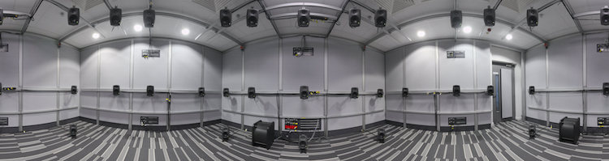
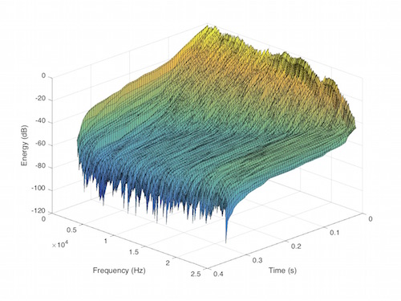

# bbcrd-brirs
 An impulse response dataset for dynamic data-based auralisation of advanced sound systems [1]

 This repository contains a free dataset of binaural room impulse responses (BRIRs) measured on a 3D multichannel loudspeaker system. This data can be used for simulating multichannel spatial audio systems on headphones. Measurements are available for multiple head orientations and so can be used in dynamic auralisation where a head tracker is available.

## Loudspeaker Arrays
 Measurements are available for 32 loudspeaker positions, which allows all loudspeaker arrays in [Recommendation ITU-R BS.2051](https://www.itu.int/rec/R-REC-BS.2051/) [4] to be simulated. This ranges from a 2-channel stereo array to the 22-channel array used in the 22.2 system.

 

## Measurement Apparatus
 Measurements were carried out in the BBC R&D listening room in Salford, UK. This room complies with [Recommendation ITU-R BS.1116](https://www.itu.int/rec/R-REC-BS.1116/) [5].
 A 3D array of 32 full-range Genelec 8030A loudspeakers was used and the impulse responses were measured using a Neumann KU100 dummy head microphone. A computer controlled rotary mount [2] was used to rotate the microphone about the vertical axis in 2˚ steps. Swept-sine signals of length 218 samples were used, ranging from 20 Hz to 24 kHz, at a sampling rate of 48 kHz. An RME Micstacy pre- amplifier was used.

 The loudspeaker sound pressure levels were aligned at the centre of the array to 70 dBA within ±0.1 dB using a band-limited pink noise signal (20 Hz-20 kHz). The loudspeaker driving signals were pre-equalised using an IOSONO Core system, to adjust for differences in the magnitude response of the direct sound and ensure time-alignment at the central listening position, equivalent to a reference distance of 2 m from the central listening position.

 The dummy head microphone was placed at the centre of the loudspeaker array, with the capsules at a height of 1.18 m from the floor. The initial microphone orientation was tested by evaluating the interaural time difference for the front centre loud- speaker. Custom software for controlling the mount and measuring the impulse responses was written in the Python language. The latency of the measurement system has been compensated. The impulse responses were truncated to 2^14 samples.

 

## BRIR Data Formats
### SOFA Files
 The impulse response data is made available in the SOFA format (AES:69 [5]) using the MultiSpeakerBRIR convention. A SOFA file is available for each speaker array within [4] as well as a file with all measured speakers. These files contain the BRIRs at all 180 orientations of the dummy head. These files are self-describing, containing the relevant meta-data regarding measurement positions.  
 APIs for reading and writing SOFA files are available at https://github.com/sofacoustics/.
### Static WAV Files
 Two-channel WAV files are provided for the BRIR for each loudspeaker at the frontal microphone orientation. These can be used with the [AmbiX plug-ins](http://www.matthiaskronlachner.com/?p=2015) amongst other systems.  
### Dynamic WAV Files
 Also 720-channel WAV files are provided, containing all microphone orientations. These enable dynamic auralisation when used with the [SoundScape Renderer](spatialaudio.net/ssr/).

## Tools for Application
### SoundScape Renderer Scenes
Scene configurations have been created for the [SoundScape Renderer](spatialaudio.net/ssr/) to allow dynamic auralisation of loudspeaker signals for array layouts in [4]. This open-source software can perform binaural room synthesis (data-based auralisation) with BRIRs and head trackers can be connected to allow dynamic auralisation. The 720-channel WAV files are used in these scene files, which can be loaded in the SSR application when the BRS renderer is used.

### AmbiX Configuration Files
Configurations for the [AmbiX plug-ins](http://www.matthiaskronlachner.com/?p=2015) have also been created for rendering higher-order ambisonics to the loudspeaker layouts in [4] and auralising the results. Ambisonics decoder design was performed according to [6]. These plug-ins can be used within a digital audio workstation and a head tracking system such as [MrHeadTracker](https://git.iem.at/DIY/MrHeadTracker) can be used to rotate the ambisonic sound field to achieve a dynamic auralisation.  
The Ambisonics decoders in the ambiX configuration files were created by Michael Romanov according to [6].

## License
Unless otherwise stated, all files in this repository are licensed under Creative Commons Attribution-NonCommercial-ShareAlike 4.0 https://creativecommons.org/licenses/by-nc-sa/4.0/

## References
[1] C. Pike and M. Romanov, “An impulse response dataset for dynamic data-based auralisation of advanced sound systems,” 142nd AES Convention, 2017.  
[2] M. Shotton, C. Pike, and F. Melchior, “A Motorised Telescope Mount as a Computer-Controlled Rotational Platform for Dummy Head Measurements,” 136th AES Convention, 2014.  
[3] AES69:2015 “AES standard for file exchange - Spatial acoustic data file format,” 2015.  
[4] Recommendation ITU-R BS.2051 "Advanced sound system for programme production," 2014.  
[5] Recommendation ITU-R BS.1116 "Methods for the subjective assessment of small impairmentsaudio systems," 2015.  
[6] M. Romanov, M. Frank, F. Zotter, and T. Nixon, “Manipulations improving amplitude panning on small standard loudspeaker arrangements for surround with height,” 29th Tonmeistertagung, 2016.
